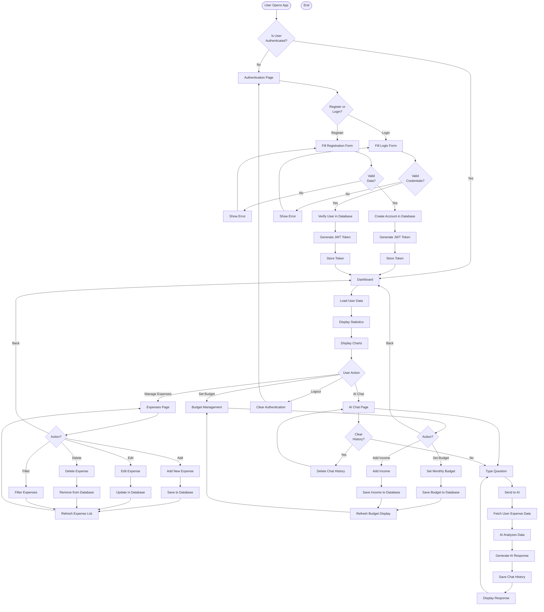

# Activity Diagram - FinWise Expense Tracker

## Complete Application Flow

```mermaid
flowchart TD
    Start([User Opens App]) --> CheckAuth{Is User<br/>Authenticated?}
    
    CheckAuth -->|No| AuthPage[Authentication Page]
    CheckAuth -->|Yes| Dashboard[Dashboard]
    
    AuthPage --> AuthChoice{Register or<br/>Login?}
    AuthChoice -->|Register| Register[Fill Registration Form]
    AuthChoice -->|Login| Login[Fill Login Form]
    
    Register --> ValidateReg{Valid<br/>Data?}
    ValidateReg -->|No| ShowRegError[Show Error]
    ShowRegError --> Register
    ValidateReg -->|Yes| CreateAccount[Create Account in Database]
    CreateAccount --> GenerateToken1[Generate JWT Token]
    GenerateToken1 --> StoreAuth1[Store Token]
    StoreAuth1 --> Dashboard
    
    Login --> ValidateLogin{Valid<br/>Credentials?}
    ValidateLogin -->|No| ShowLoginError[Show Error]
    ShowLoginError --> Login
    ValidateLogin -->|Yes| VerifyUser[Verify User in Database]
    VerifyUser --> GenerateToken2[Generate JWT Token]
    GenerateToken2 --> StoreAuth2[Store Token]
    StoreAuth2 --> Dashboard
    
    Dashboard --> LoadData[Load User Data]
    LoadData --> DisplayStats[Display Statistics]
    DisplayStats --> DisplayCharts[Display Charts]
    DisplayCharts --> UserAction{User Action}
    
    UserAction -->|Manage Expenses| ExpensePage[Expenses Page]
    UserAction -->|Set Budget| BudgetPage[Budget Management]
    UserAction -->|AI Chat| ChatPage[AI Chat Page]
    UserAction -->|Logout| ClearAuth[Clear Authentication]
    ClearAuth --> AuthPage
    
    ExpensePage --> ExpenseAction{Action?}
    ExpenseAction -->|Add| AddExpense[Add New Expense]
    ExpenseAction -->|Edit| EditExpense[Edit Expense]
    ExpenseAction -->|Delete| DeleteExpense[Delete Expense]
    ExpenseAction -->|Filter| FilterExpenses[Filter Expenses]
    ExpenseAction -->|Back| Dashboard
    
    AddExpense --> SaveExpense[Save to Database]
    EditExpense --> UpdateExpense[Update in Database]
    DeleteExpense --> RemoveExpense[Remove from Database]
    SaveExpense --> RefreshExpenses[Refresh Expense List]
    UpdateExpense --> RefreshExpenses
    RemoveExpense --> RefreshExpenses
    FilterExpenses --> RefreshExpenses
    RefreshExpenses --> ExpensePage
    
    BudgetPage --> BudgetAction{Action?}
    BudgetAction -->|Set Budget| SetBudget[Set Monthly Budget]
    BudgetAction -->|Add Income| AddIncome[Add Income]
    BudgetAction -->|Back| Dashboard
    
    SetBudget --> SaveBudget[Save Budget to Database]
    AddIncome --> SaveIncome[Save Income to Database]
    SaveBudget --> RefreshBudget[Refresh Budget Display]
    SaveIncome --> RefreshBudget
    RefreshBudget --> BudgetPage
    
    ChatPage --> TypeQuestion[Type Question]
    TypeQuestion --> SendQuestion[Send to AI]
    SendQuestion --> FetchUserData[Fetch User Expense Data]
    FetchUserData --> Analyze[AI Analyzes Data]
    Analyze --> GenerateResponse[Generate AI Response]
    GenerateResponse --> SaveChat[Save Chat History]
    SaveChat --> DisplayResponse[Display Response]
    DisplayResponse --> TypeQuestion
    
    ChatPage --> ClearChat{Clear<br/>History?}
    ClearChat -->|Yes| DeleteHistory[Delete Chat History]
    DeleteHistory --> ChatPage
    ClearChat -->|No| TypeQuestion
    
    End([End])
```
