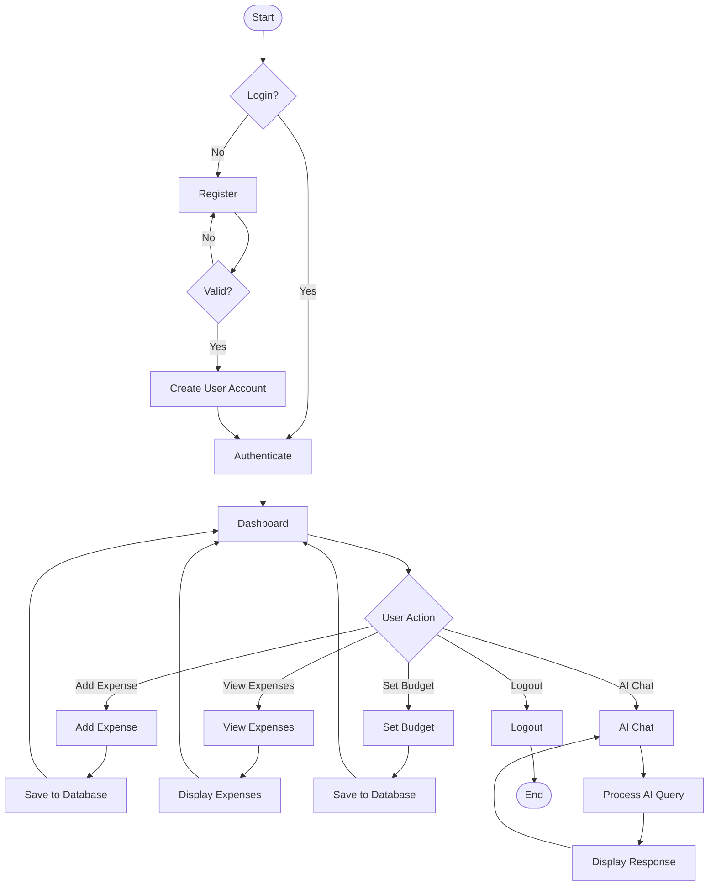

# Activity Diagram - FinWise

```mermaid
flowchart TD
    Start([Start]) --> Login{Login?}
    Login -->|No| Register[Register]
    Login -->|Yes| Authenticate[Authenticate]
    
    Register --> ValidateReg{Valid?}
    ValidateReg -->|No| Register
    ValidateReg -->|Yes| CreateUser[Create User Account]
    CreateUser --> Authenticate
    
    Authenticate --> Dashboard[Dashboard]
    Dashboard --> Action{User Action}
    
    Action -->|Add Expense| AddExpense[Add Expense]
    Action -->|View Expenses| ViewExpenses[View Expenses]
    Action -->|Set Budget| SetBudget[Set Budget]
    Action -->|AI Chat| AIChat[AI Chat]
    Action -->|Logout| Logout[Logout]
    
    AddExpense --> SaveExpense[Save to Database]
    ViewExpenses --> DisplayExpenses[Display Expenses]
    SetBudget --> SaveBudget[Save to Database]
    AIChat --> ProcessAI[Process AI Query]
    Logout --> End([End])
    
    SaveExpense --> Dashboard
    DisplayExpenses --> Dashboard
    SaveBudget --> Dashboard
    ProcessAI --> DisplayResponse[Display Response]
    DisplayResponse --> AIChat
```
