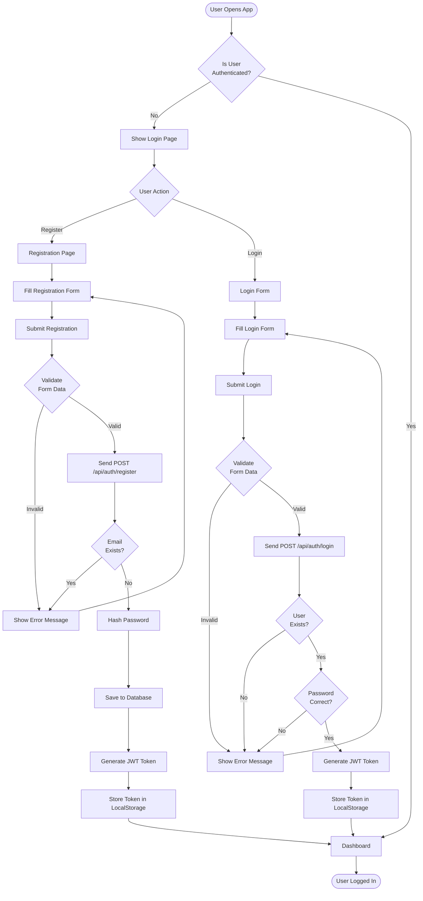
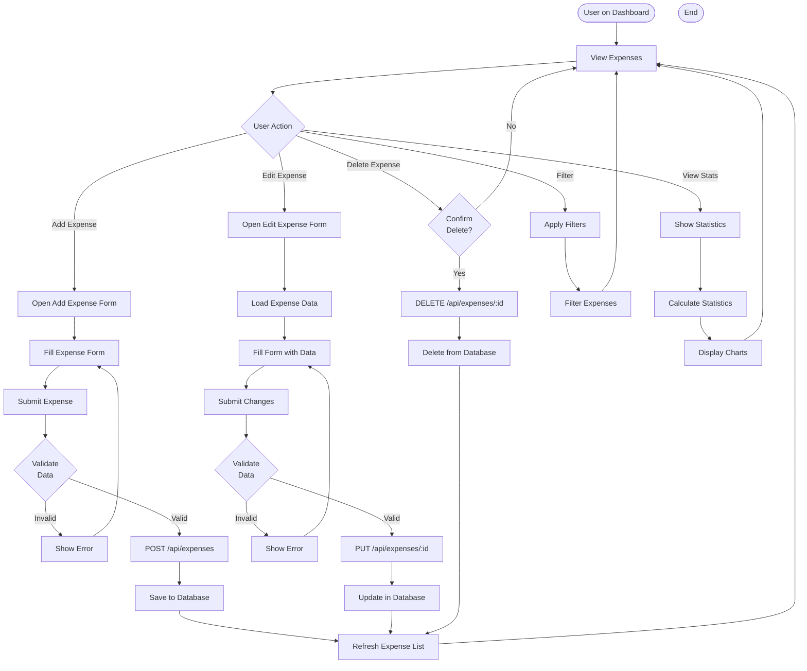
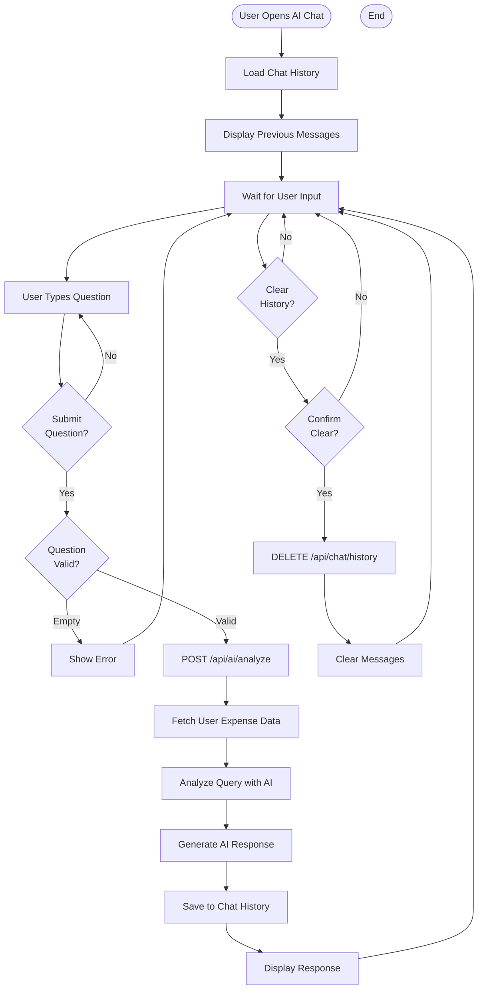
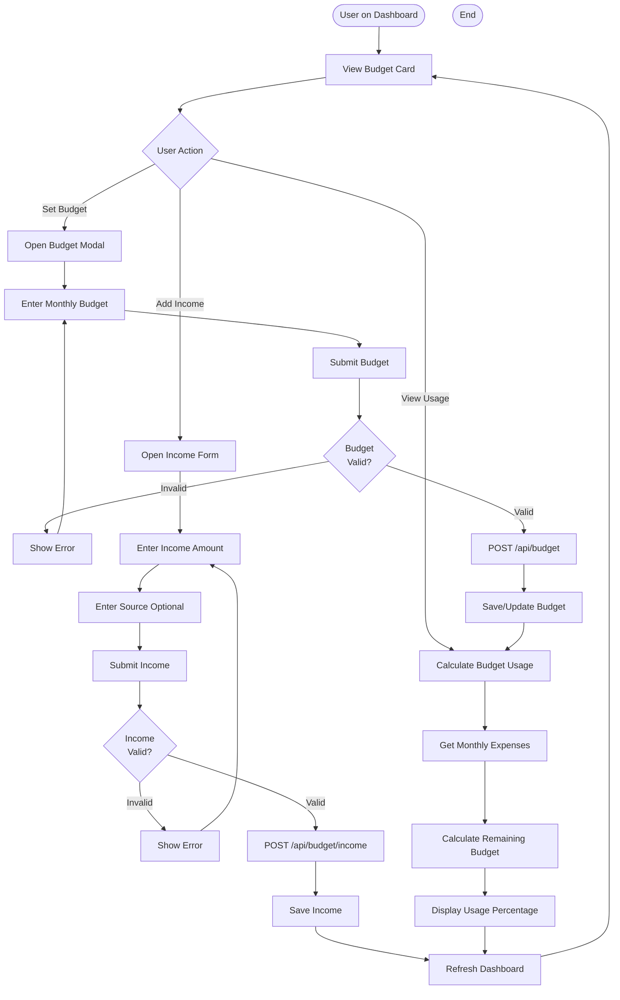

# Activity Diagram - FinWise Expense Tracker

## User Registration & Login Flow

```mermaid
flowchart TD
    Start([User Opens App]) --> CheckAuth{Is User<br/>Authenticated?}
    CheckAuth -->|No| ShowLogin[Show Login Page]
    CheckAuth -->|Yes| Dashboard[Dashboard]
    
    ShowLogin --> UserChoice{User Action}
    UserChoice -->|Register| RegisterPage[Registration Page]
    UserChoice -->|Login| LoginForm[Login Form]
    
    RegisterPage --> FillRegForm[Fill Registration Form]
    FillRegForm --> SubmitReg[Submit Registration]
    SubmitReg --> ValidateReg{Validate<br/>Form Data}
    ValidateReg -->|Invalid| ShowRegError[Show Error Message]
    ShowRegError --> FillRegForm
    ValidateReg -->|Valid| SendRegRequest[Send POST /api/auth/register]
    SendRegRequest --> CheckEmail{Email<br/>Exists?}
    CheckEmail -->|Yes| ShowRegError
    CheckEmail -->|No| HashPassword[Hash Password]
    HashPassword --> SaveUser[Save to Database]
    SaveUser --> GenerateToken[Generate JWT Token]
    GenerateToken --> StoreToken[Store Token in LocalStorage]
    StoreToken --> Dashboard
    
    LoginForm --> FillLoginForm[Fill Login Form]
    FillLoginForm --> SubmitLogin[Submit Login]
    SubmitLogin --> ValidateLogin{Validate<br/>Form Data}
    ValidateLogin -->|Invalid| ShowLoginError[Show Error Message]
    ShowLoginError --> FillLoginForm
    ValidateLogin -->|Valid| SendLoginRequest[Send POST /api/auth/login]
    SendLoginRequest --> FindUser{User<br/>Exists?}
    FindUser -->|No| ShowLoginError
    FindUser -->|Yes| VerifyPassword{Password<br/>Correct?}
    VerifyPassword -->|No| ShowLoginError
    VerifyPassword -->|Yes| GenerateToken2[Generate JWT Token]
    GenerateToken2 --> StoreToken2[Store Token in LocalStorage]
    StoreToken2 --> Dashboard
    
    Dashboard --> End([User Logged In])
```

## Expense Management Flow

```mermaid
flowchart TD
    Start([User on Dashboard]) --> ViewExpenses[View Expenses]
    ViewExpenses --> UserAction{User Action}
    
    UserAction -->|Add Expense| AddExpenseForm[Open Add Expense Form]
    UserAction -->|Edit Expense| EditExpenseForm[Open Edit Expense Form]
    UserAction -->|Delete Expense| ConfirmDelete{Confirm<br/>Delete?}
    UserAction -->|Filter| ApplyFilters[Apply Filters]
    UserAction -->|View Stats| ShowStats[Show Statistics]
    
    AddExpenseForm --> FillExpenseForm[Fill Expense Form]
    FillExpenseForm --> SubmitExpense[Submit Expense]
    SubmitExpense --> ValidateExpense{Validate<br/>Data}
    ValidateExpense -->|Invalid| ShowExpenseError[Show Error]
    ShowExpenseError --> FillExpenseForm
    ValidateExpense -->|Valid| SendExpenseRequest[POST /api/expenses]
    SendExpenseRequest --> SaveExpense[Save to Database]
    SaveExpense --> RefreshList[Refresh Expense List]
    RefreshList --> ViewExpenses
    
    EditExpenseForm --> LoadExpenseData[Load Expense Data]
    LoadExpenseData --> FillExpenseForm2[Fill Form with Data]
    FillExpenseForm2 --> SubmitEdit[Submit Changes]
    SubmitEdit --> ValidateExpense2{Validate<br/>Data}
    ValidateExpense2 -->|Invalid| ShowExpenseError2[Show Error]
    ShowExpenseError2 --> FillExpenseForm2
    ValidateExpense2 -->|Valid| SendUpdateRequest[PUT /api/expenses/:id]
    SendUpdateRequest --> UpdateExpense[Update in Database]
    UpdateExpense --> RefreshList
    
    ConfirmDelete -->|Yes| SendDeleteRequest[DELETE /api/expenses/:id]
    ConfirmDelete -->|No| ViewExpenses
    SendDeleteRequest --> DeleteExpense[Delete from Database]
    DeleteExpense --> RefreshList
    
    ApplyFilters --> FilterExpenses[Filter Expenses]
    FilterExpenses --> ViewExpenses
    
    ShowStats --> CalculateStats[Calculate Statistics]
    CalculateStats --> DisplayCharts[Display Charts]
    DisplayCharts --> ViewExpenses
    
    End([End])
```

## AI Chat Flow

```mermaid
flowchart TD
    Start([User Opens AI Chat]) --> LoadHistory[Load Chat History]
    LoadHistory --> DisplayHistory[Display Previous Messages]
    DisplayHistory --> WaitInput[Wait for User Input]
    
    WaitInput --> UserTypes[User Types Question]
    UserTypes --> SubmitQuestion{Submit<br/>Question?}
    SubmitQuestion -->|No| UserTypes
    SubmitQuestion -->|Yes| ValidateQuestion{Question<br/>Valid?}
    
    ValidateQuestion -->|Empty| ShowError[Show Error]
    ShowError --> WaitInput
    ValidateQuestion -->|Valid| SendToAI[POST /api/ai/analyze]
    
    SendToAI --> FetchData[Fetch User Expense Data]
    FetchData --> AnalyzeQuery[Analyze Query with AI]
    AnalyzeQuery --> GenerateResponse[Generate AI Response]
    GenerateResponse --> SaveChat[Save to Chat History]
    SaveChat --> DisplayResponse[Display Response]
    DisplayResponse --> WaitInput
    
    WaitInput --> ClearHistory{Clear<br/>History?}
    ClearHistory -->|Yes| ConfirmClear{Confirm<br/>Clear?}
    ConfirmClear -->|Yes| DeleteHistory[DELETE /api/chat/history]
    DeleteHistory --> ClearMessages[Clear Messages]
    ClearMessages --> WaitInput
    ConfirmClear -->|No| WaitInput
    ClearHistory -->|No| WaitInput
    
    End([End])
```

## Budget Management Flow

```mermaid
flowchart TD
    Start([User on Dashboard]) --> ViewBudget[View Budget Card]
    ViewBudget --> BudgetAction{User Action}
    
    BudgetAction -->|Set Budget| OpenBudgetModal[Open Budget Modal]
    BudgetAction -->|Add Income| OpenIncomeForm[Open Income Form]
    BudgetAction -->|View Usage| CalculateUsage[Calculate Budget Usage]
    
    OpenBudgetModal --> EnterBudget[Enter Monthly Budget]
    EnterBudget --> SubmitBudget[Submit Budget]
    SubmitBudget --> ValidateBudget{Budget<br/>Valid?}
    ValidateBudget -->|Invalid| ShowBudgetError[Show Error]
    ShowBudgetError --> EnterBudget
    ValidateBudget -->|Valid| SendBudgetRequest[POST /api/budget]
    SendBudgetRequest --> SaveBudget[Save/Update Budget]
    SaveBudget --> CalculateUsage
    
    OpenIncomeForm --> EnterIncome[Enter Income Amount]
    EnterIncome --> EnterSource[Enter Source Optional]
    EnterSource --> SubmitIncome[Submit Income]
    SubmitIncome --> ValidateIncome{Income<br/>Valid?}
    ValidateIncome -->|Invalid| ShowIncomeError[Show Error]
    ShowIncomeError --> EnterIncome
    ValidateIncome -->|Valid| SendIncomeRequest[POST /api/budget/income]
    SendIncomeRequest --> SaveIncome[Save Income]
    SaveIncome --> RefreshDashboard[Refresh Dashboard]
    
    CalculateUsage --> GetExpenses[Get Monthly Expenses]
    GetExpenses --> CalculateRemaining[Calculate Remaining Budget]
    CalculateRemaining --> DisplayUsage[Display Usage Percentage]
    DisplayUsage --> RefreshDashboard
    
    RefreshDashboard --> ViewBudget
    
    End([End])
```

