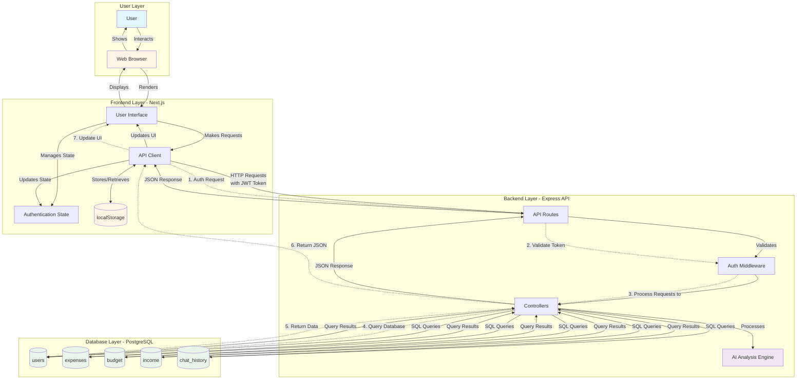

# Data Flow Diagram - FinWise Expense Tracker

## Complete Application Data Flow

```mermaid
flowchart TB
    subgraph "User Layer"
        User[User]
        Browser[Web Browser]
    end
    
    subgraph "Frontend Layer - Next.js"
        UI[User Interface]
        AuthState[Authentication State]
        APIClient[API Client]
        LocalStorage[(localStorage)]
    end
    
    subgraph "Backend Layer - Express API"
        APIRoutes[API Routes]
        AuthMiddleware[Auth Middleware]
        Controllers[Controllers]
        AIEngine[AI Analysis Engine]
    end
    
    subgraph "Database Layer - PostgreSQL"
        Users[(users)]
        Expenses[(expenses)]
        Budget[(budget)]
        Income[(income)]
        ChatHistory[(chat_history)]
    end
    
    %% User Interactions
    User -->|Interacts| Browser
    Browser -->|Renders| UI
    UI -->|Manages State| AuthState
    UI -->|Makes Requests| APIClient
    APIClient <-->|Stores/Retrieves| LocalStorage
    
    %% API Communication
    APIClient -->|HTTP Requests<br/>with JWT Token| APIRoutes
    APIRoutes -->|Validates| AuthMiddleware
    AuthMiddleware -->|Routes to| Controllers
    Controllers -->|Processes| AIEngine
    
    %% Database Operations
    Controllers -->|SQL Queries| Users
    Controllers -->|SQL Queries| Expenses
    Controllers -->|SQL Queries| Budget
    Controllers -->|SQL Queries| Income
    Controllers -->|SQL Queries| ChatHistory
    
    %% Data Returns
    Users -->|Query Results| Controllers
    Expenses -->|Query Results| Controllers
    Budget -->|Query Results| Controllers
    Income -->|Query Results| Controllers
    ChatHistory -->|Query Results| Controllers
    
    %% Response Flow
    Controllers -->|JSON Response| APIRoutes
    APIRoutes -->|JSON Response| APIClient
    APIClient -->|Updates State| AuthState
    APIClient -->|Updates UI| UI
    UI -->|Displays| Browser
    Browser -->|Shows| User
    
    %% Data Flow Labels
    APIClient -.->|1. Auth Request| APIRoutes
    APIRoutes -.->|2. Validate Token| AuthMiddleware
    AuthMiddleware -.->|3. Process Request| Controllers
    Controllers -.->|4. Query Database| Users
    Users -.->|5. Return Data| Controllers
    Controllers -.->|6. Return JSON| APIClient
    APIClient -.->|7. Update UI| UI
    
    style User fill:#e1f5ff
    style Browser fill:#fff4e6
    style LocalStorage fill:#fff4e6
    style Users fill:#e8f5e9
    style Expenses fill:#e8f5e9
    style Budget fill:#e8f5e9
    style Income fill:#e8f5e9
    style ChatHistory fill:#e8f5e9
    style AIEngine fill:#f3e5f5
```
