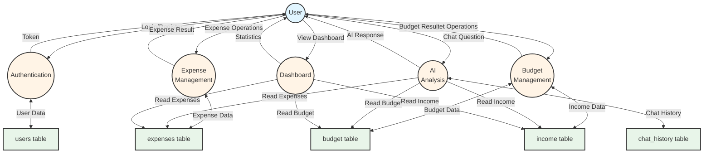

# Data Flow Diagram - FinWise

```mermaid
flowchart TD
    User((User))
    
    Auth((Authentication))
    ExpenseMgmt((Expense<br/>Management))
    BudgetMgmt((Budget<br/>Management))
    AIChat((AI<br/>Analysis))
    Dashboard((Dashboard))
    
    UsersTable[users table]
    ExpensesTable[expenses table]
    BudgetTable[budget table]
    IncomeTable[income table]
    ChatTable[chat_history table]
    
    %% User Interactions
    User -->|Login/Register| Auth
    User -->|Expense Operations| ExpenseMgmt
    User -->|Budget Operations| BudgetMgmt
    User -->|Chat Question| AIChat
    User -->|View Dashboard| Dashboard
    
    %% Authentication Flow
    Auth <-->|User Data| UsersTable
    Auth -->|Token| User
    
    %% Expense Management Flow
    ExpenseMgmt <-->|Expense Data| ExpensesTable
    ExpenseMgmt -->|Expense Result| User
    
    %% Budget Management Flow
    BudgetMgmt <-->|Budget Data| BudgetTable
    BudgetMgmt <-->|Income Data| IncomeTable
    BudgetMgmt -->|Budget Result| User
    
    %% AI Chat Flow
    AIChat -->|Read Expenses| ExpensesTable
    AIChat -->|Read Budget| BudgetTable
    AIChat -->|Read Income| IncomeTable
    AIChat <-->|Chat History| ChatTable
    AIChat -->|AI Response| User
    
    %% Dashboard Flow
    Dashboard -->|Read Expenses| ExpensesTable
    Dashboard -->|Read Budget| BudgetTable
    Dashboard -->|Read Income| IncomeTable
    Dashboard -->|Statistics| User
    
    style User fill:#e1f5ff,stroke:#333,stroke-width:2px
    style Auth fill:#fff4e6,stroke:#333,stroke-width:2px
    style ExpenseMgmt fill:#fff4e6,stroke:#333,stroke-width:2px
    style BudgetMgmt fill:#fff4e6,stroke:#333,stroke-width:2px
    style AIChat fill:#fff4e6,stroke:#333,stroke-width:2px
    style Dashboard fill:#fff4e6,stroke:#333,stroke-width:2px
    style UsersTable fill:#e8f5e9,stroke:#333,stroke-width:2px
    style ExpensesTable fill:#e8f5e9,stroke:#333,stroke-width:2px
    style BudgetTable fill:#e8f5e9,stroke:#333,stroke-width:2px
    style IncomeTable fill:#e8f5e9,stroke:#333,stroke-width:2px
    style ChatTable fill:#e8f5e9,stroke:#333,stroke-width:2px
```
