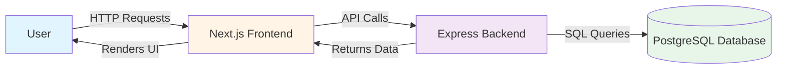
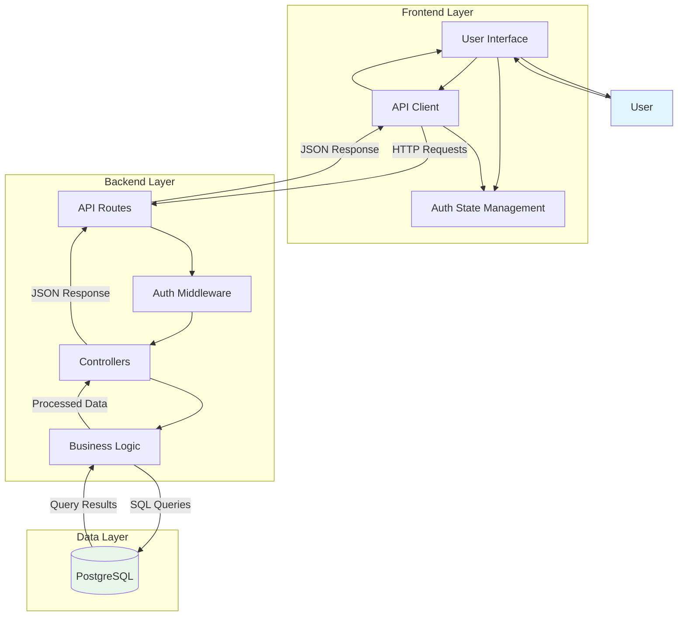
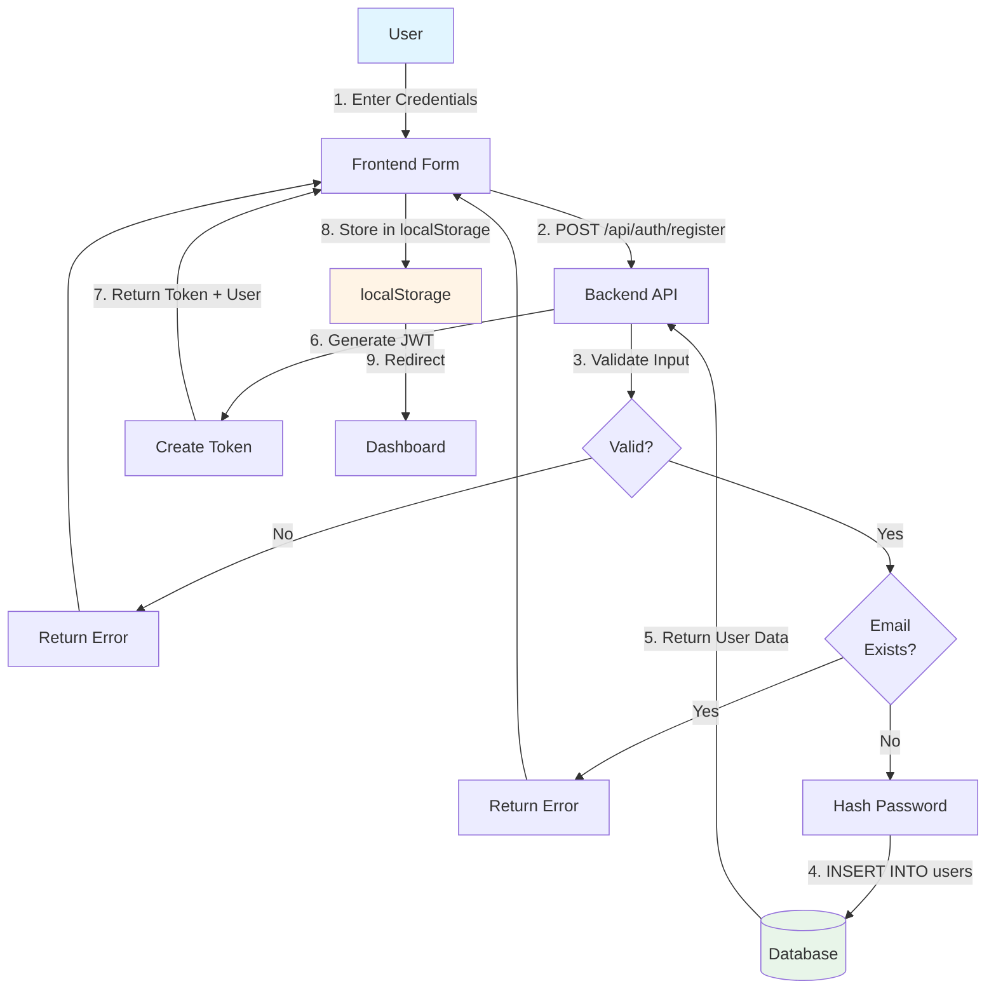
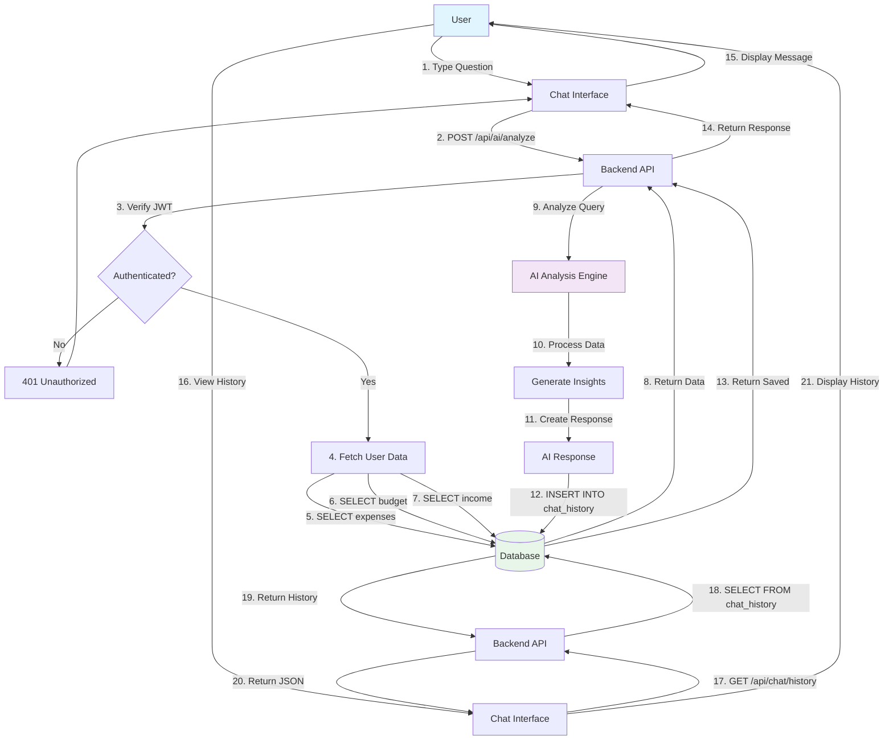
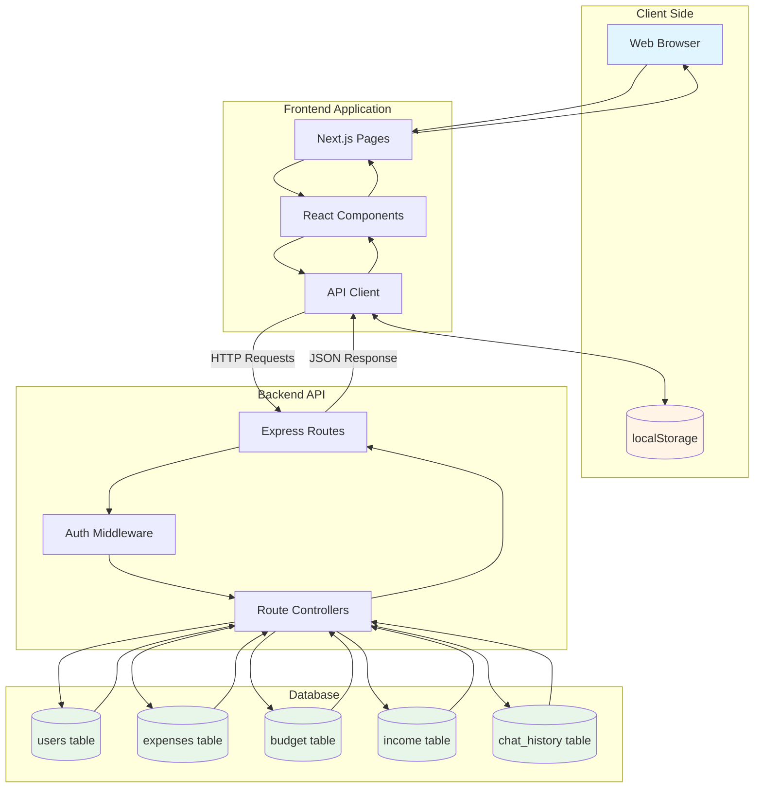

# Data Flow Diagram - FinWise Expense Tracker

## Level 0 - Context Diagram



## Level 1 - System Overview



## Authentication Data Flow



## Expense Management Data Flow

```mermaid
flowchart TD
    User[User] -->|1. Create Expense| Frontend[Expense Form]
    Frontend -->|2. POST /api/expenses| Backend[Backend API]
    
    Backend -->|3. Verify JWT| Auth{Authenticated?}
    Auth -->|No| Error1[401 Unauthorized]
    Error1 --> Frontend
    
    Auth -->|Yes| Validate{Valid Data?}
    Validate -->|No| Error2[400 Bad Request]
    Error2 --> Frontend
    
    Validate -->|Yes| Insert|4. INSERT INTO expenses| Database[(Database)]
    Database -->|5. Return Expense| Backend
    Backend -->|6. Return JSON| Frontend
    Frontend -->|7. Update UI| Dashboard[Dashboard]
    
    Dashboard -->|8. GET /api/expenses/stats| Backend2[Backend API]
    Backend2 -->|9. SELECT SUM, GROUP BY| Database
    Database -->|10. Return Stats| Backend2
    Backend2 -->|11. Return JSON| Dashboard
    Dashboard -->|12. Display Charts| User
    
    style User fill:#e1f5ff
    style Database fill:#e8f5e9
```

## AI Chat Data Flow



## Budget Management Data Flow

```mermaid
flowchart TD
    User[User] -->|1. Set Budget| Frontend[Budget Form]
    Frontend -->|2. POST /api/budget| Backend[Backend API]
    
    Backend -->|3. Verify JWT| Auth{Authenticated?}
    Auth -->|No| Error1[401 Unauthorized]
    Error1 --> Frontend
    
    Auth -->|Yes| CheckBudget{Budget<br/>Exists?}
    CheckBudget -->|Yes| Update|4. UPDATE budget| Database[(Database)]
    CheckBudget -->|No| Insert|4. INSERT INTO budget| Database
    
    Database -->|5. Return Budget| Backend
    Backend -->|6. Return JSON| Frontend
    Frontend -->|7. Update UI| Dashboard[Dashboard]
    
    Dashboard -->|8. GET /api/budget| Backend2[Backend API]
    Backend2 -->|9. SELECT FROM budget| Database
    Backend2 -->|10. SELECT SUM expenses| Database
    Database -->|11. Return Data| Backend2
    Backend2 -->|12. Calculate Usage| Calculate[Calculate %]
    Calculate -->|13. Return JSON| Dashboard
    Dashboard -->|14. Display Usage| User
    
    User -->|15. Add Income| Frontend2[Income Form]
    Frontend2 -->|16. POST /api/budget/income| Backend3[Backend API]
    Backend3 -->|17. Verify JWT| Auth2{Authenticated?}
    Auth2 -->|No| Error2[401 Unauthorized]
    Error2 --> Frontend2
    Auth2 -->|Yes| InsertIncome|18. INSERT INTO income| Database
    Database -->|19. Return Income| Backend3
    Backend3 -->|20. Return JSON| Frontend2
    Frontend2 -->|21. Update Dashboard| Dashboard
    
    style User fill:#e1f5ff
    style Database fill:#e8f5e9
```

## Complete System Data Flow



