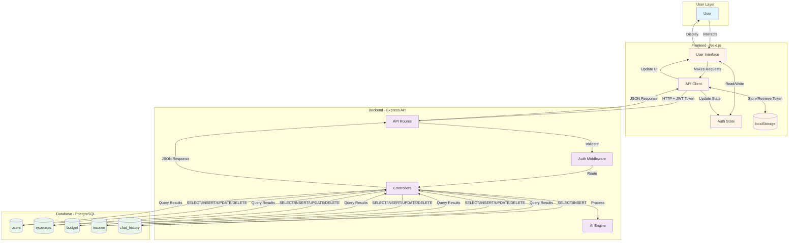

# Data Flow Diagram - FinWise

```mermaid
flowchart TB
    subgraph "User Layer"
        User[User]
    end
    
    subgraph "Frontend - Next.js"
        UI[User Interface]
        AuthState[Auth State]
        APIClient[API Client]
        LocalStorage[(localStorage)]
    end
    
    subgraph "Backend - Express API"
        APIRoutes[API Routes]
        AuthMiddleware[Auth Middleware]
        Controllers[Controllers]
        AIEngine[AI Engine]
    end
    
    subgraph "Database - PostgreSQL"
        Users[(users)]
        Expenses[(expenses)]
        Budget[(budget)]
        Income[(income)]
        ChatHistory[(chat_history)]
    end
    
    %% User to Frontend
    User -->|Interacts| UI
    UI <-->|Read/Write| AuthState
    UI -->|Makes Requests| APIClient
    APIClient <-->|Store/Retrieve Token| LocalStorage
    
    %% Frontend to Backend
    APIClient -->|HTTP + JWT Token| APIRoutes
    APIRoutes -->|Validate| AuthMiddleware
    AuthMiddleware -->|Route| Controllers
    Controllers -->|Process| AIEngine
    
    %% Backend to Database
    Controllers -->|SELECT/INSERT/UPDATE/DELETE| Users
    Controllers -->|SELECT/INSERT/UPDATE/DELETE| Expenses
    Controllers -->|SELECT/INSERT/UPDATE/DELETE| Budget
    Controllers -->|SELECT/INSERT/UPDATE/DELETE| Income
    Controllers -->|SELECT/INSERT| ChatHistory
    
    %% Database to Backend
    Users -->|Query Results| Controllers
    Expenses -->|Query Results| Controllers
    Budget -->|Query Results| Controllers
    Income -->|Query Results| Controllers
    ChatHistory -->|Query Results| Controllers
    
    %% Backend to Frontend
    Controllers -->|JSON Response| APIRoutes
    APIRoutes -->|JSON Response| APIClient
    APIClient -->|Update State| AuthState
    APIClient -->|Update UI| UI
    
    %% Frontend to User
    UI -->|Display| User
    
    style User fill:#e1f5ff
    style UI fill:#fff4e6
    style AuthState fill:#fff4e6
    style APIClient fill:#fff4e6
    style LocalStorage fill:#fff4e6
    style APIRoutes fill:#f3e5f5
    style AuthMiddleware fill:#f3e5f5
    style Controllers fill:#f3e5f5
    style AIEngine fill:#f3e5f5
    style Users fill:#e8f5e9
    style Expenses fill:#e8f5e9
    style Budget fill:#e8f5e9
    style Income fill:#e8f5e9
    style ChatHistory fill:#e8f5e9
```
