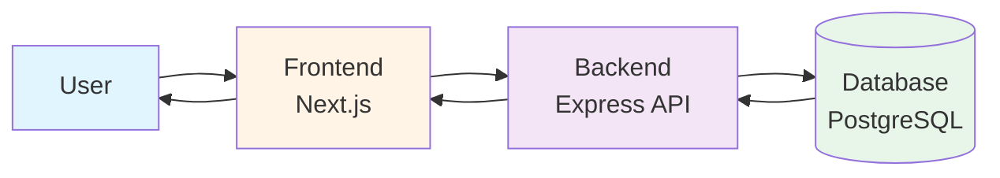

# Data Flow Diagram - FinWise

```mermaid
flowchart LR
    User[User] --> Frontend[Frontend<br/>Next.js]
    Frontend --> Backend[Backend<br/>Express API]
    Backend --> Database[(Database<br/>PostgreSQL)]
    
    Database --> Backend
    Backend --> Frontend
    Frontend --> User
    
    style User fill:#e1f5ff
    style Frontend fill:#fff4e6
    style Backend fill:#f3e5f5
    style Database fill:#e8f5e9
```
