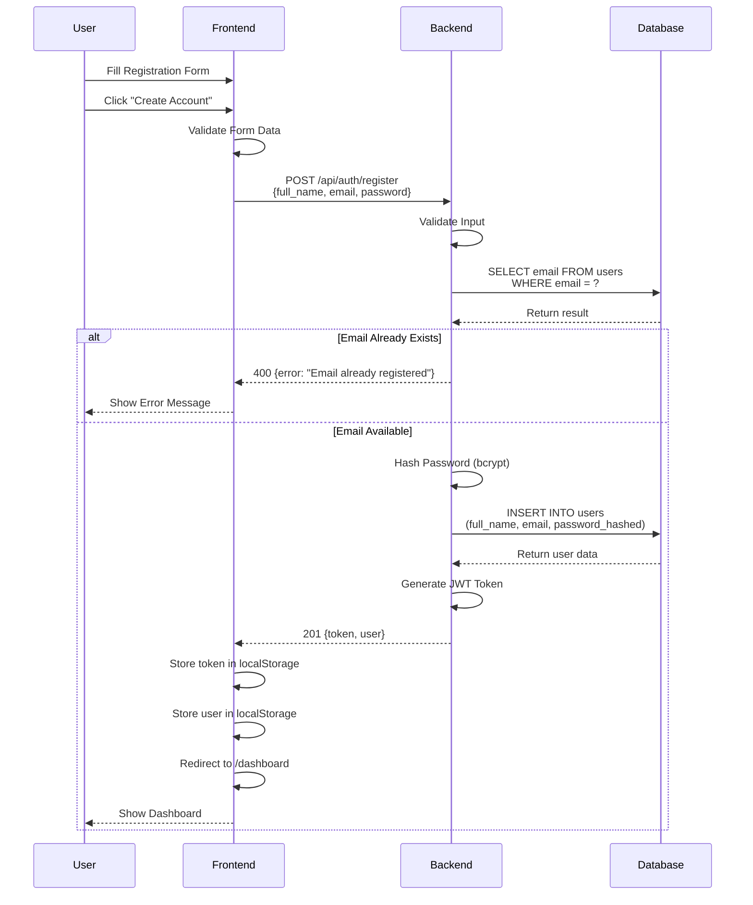
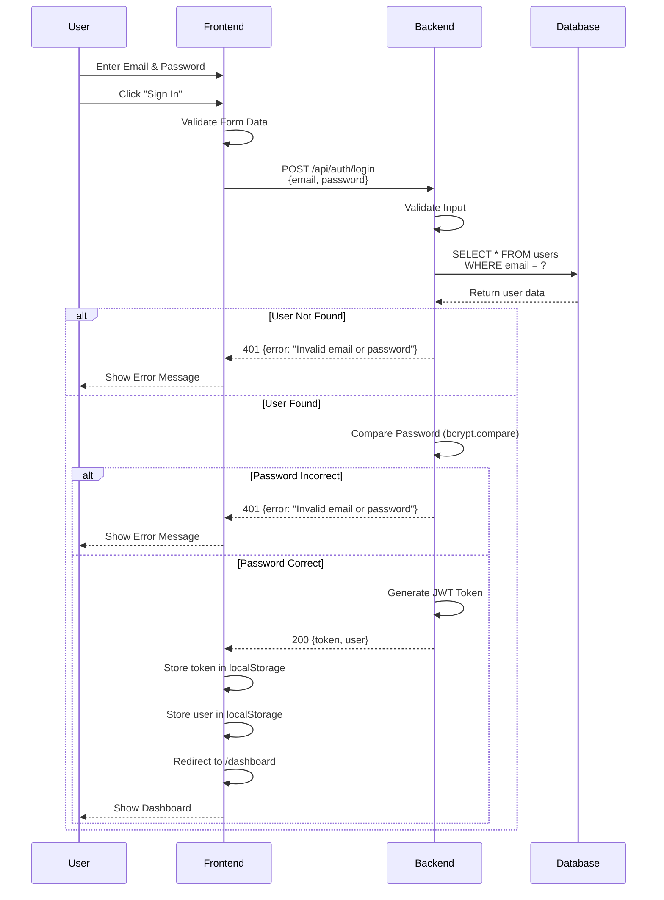
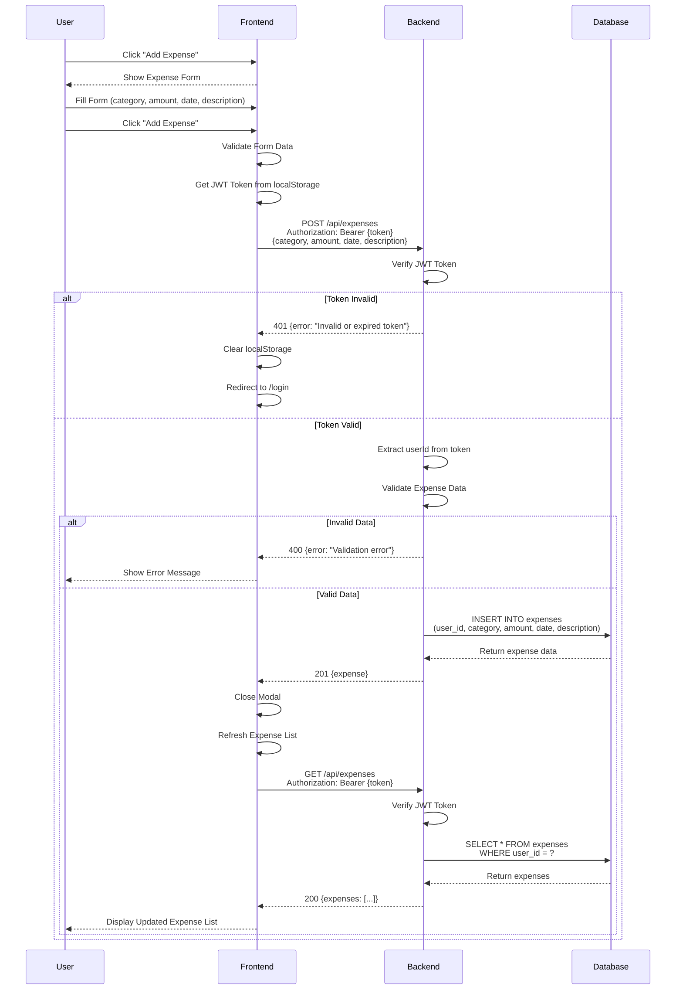
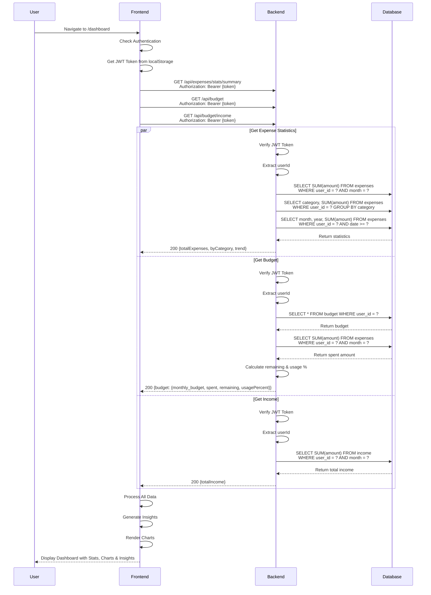
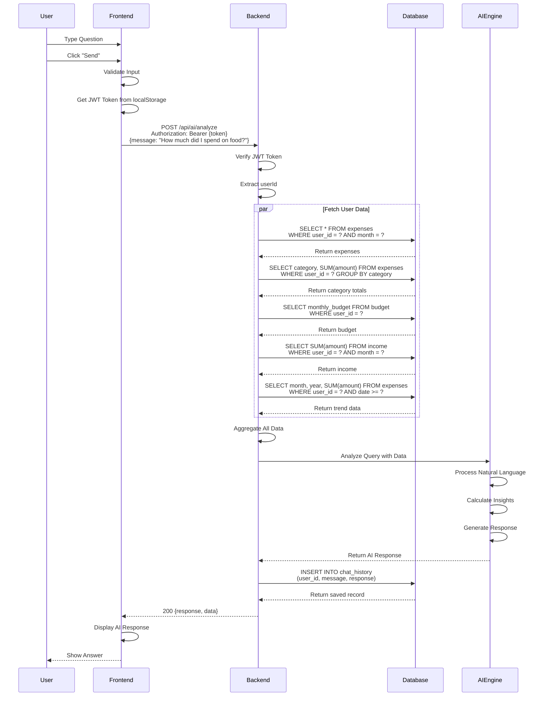
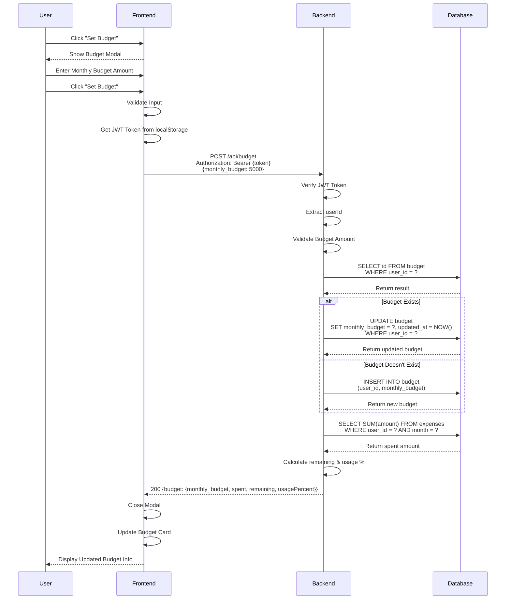
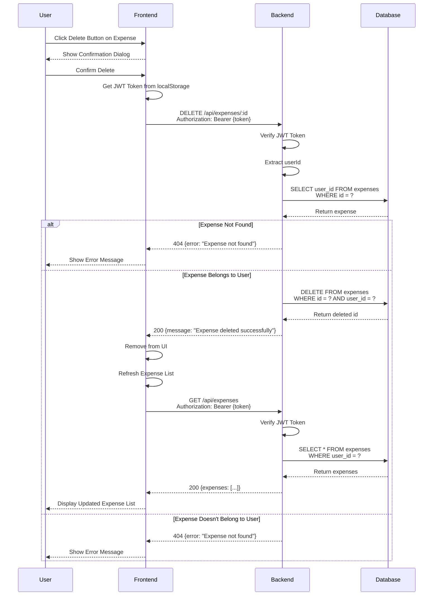
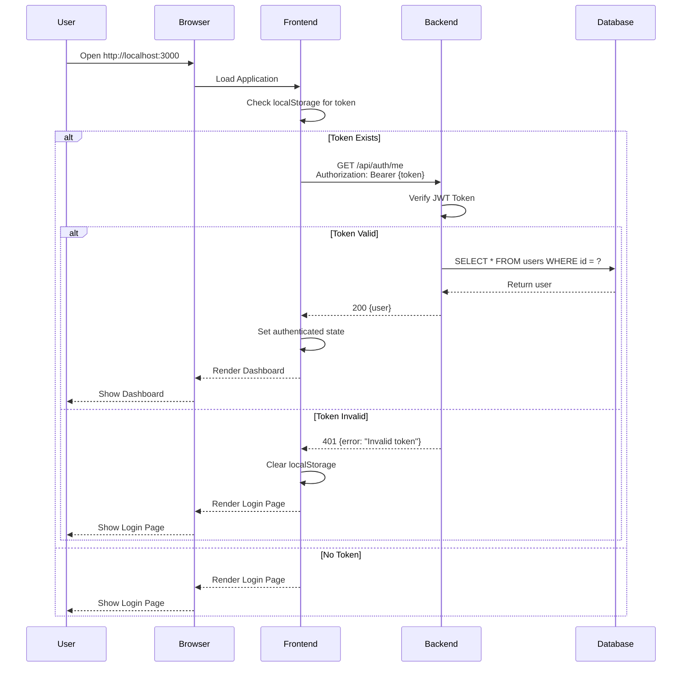

# Sequence Diagram - FinWise Expense Tracker

## User Registration Sequence

## User Login Sequence

## Add Expense Sequence

## View Dashboard Sequence

## AI Chat Sequence

## Set Budget Sequence

## Delete Expense Sequence

## Complete Authentication Flow Sequence

