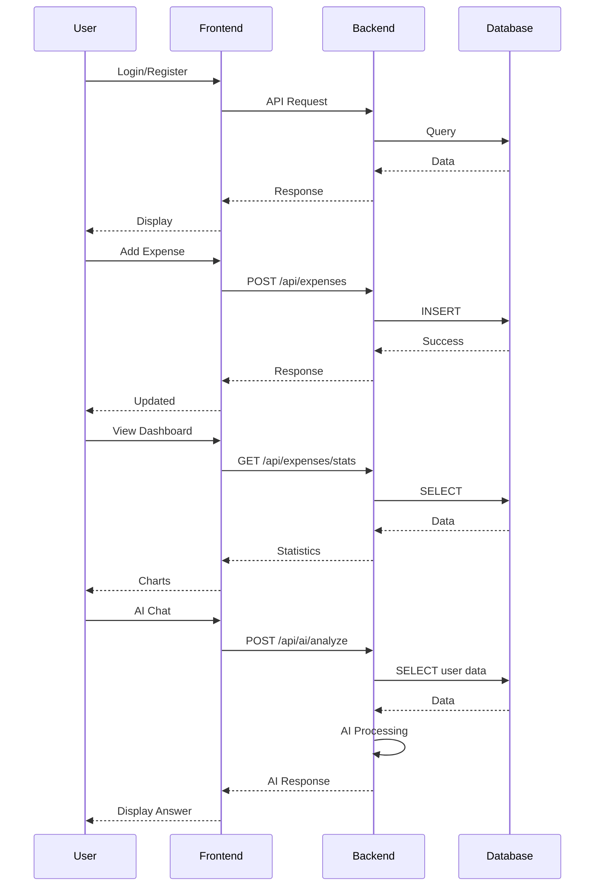

# Sequence Diagram - FinWise

```mermaid
sequenceDiagram
    participant User
    participant Frontend
    participant Backend
    participant Database
    
    User->>Frontend: Login/Register
    Frontend->>Backend: API Request
    Backend->>Database: Query
    Database-->>Backend: Data
    Backend-->>Frontend: Response
    Frontend-->>User: Display
    
    User->>Frontend: Add Expense
    Frontend->>Backend: POST /api/expenses
    Backend->>Database: INSERT
    Database-->>Backend: Success
    Backend-->>Frontend: Response
    Frontend-->>User: Updated
    
    User->>Frontend: View Dashboard
    Frontend->>Backend: GET /api/expenses/stats
    Backend->>Database: SELECT
    Database-->>Backend: Data
    Backend-->>Frontend: Statistics
    Frontend-->>User: Charts
    
    User->>Frontend: AI Chat
    Frontend->>Backend: POST /api/ai/analyze
    Backend->>Database: SELECT user data
    Database-->>Backend: Data
    Backend->>Backend: AI Processing
    Backend-->>Frontend: AI Response
    Frontend-->>User: Display Answer
```
