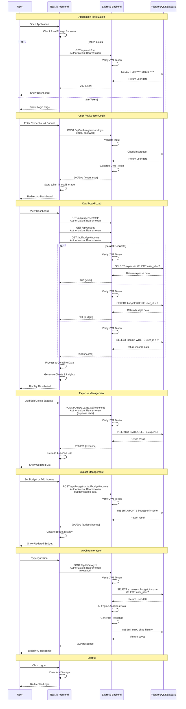

# Sequence Diagram - FinWise Expense Tracker

## Complete Application Sequence

```mermaid
sequenceDiagram
    participant User
    participant Frontend as Next.js Frontend
    participant Backend as Express Backend
    participant Database as PostgreSQL Database
    
    Note over User,Database: Application Initialization
    User->>Frontend: Open Application
    Frontend->>Frontend: Check localStorage for token
    alt Token Exists
        Frontend->>Backend: GET /api/auth/me<br/>Authorization: Bearer token
        Backend->>Backend: Verify JWT Token
        Backend->>Database: SELECT user WHERE id = ?
        Database-->>Backend: Return user data
        Backend-->>Frontend: 200 {user}
        Frontend-->>User: Show Dashboard
    else No Token
        Frontend-->>User: Show Login Page
    end
    
    Note over User,Database: User Registration/Login
    User->>Frontend: Enter Credentials & Submit
    Frontend->>Backend: POST /api/auth/register or /login<br/>{email, password}
    Backend->>Backend: Validate Input
    Backend->>Database: Check/Insert user
    Database-->>Backend: Return user data
    Backend->>Backend: Generate JWT Token
    Backend-->>Frontend: 200/201 {token, user}
    Frontend->>Frontend: Store token in localStorage
    Frontend-->>User: Redirect to Dashboard
    
    Note over User,Database: Dashboard Load
    User->>Frontend: View Dashboard
    Frontend->>Backend: GET /api/expenses/stats<br/>Authorization: Bearer token
    Frontend->>Backend: GET /api/budget<br/>Authorization: Bearer token
    Frontend->>Backend: GET /api/budget/income<br/>Authorization: Bearer token
    
    par Parallel Requests
        Backend->>Backend: Verify JWT Token
        Backend->>Database: SELECT expenses WHERE user_id = ?
        Database-->>Backend: Return expense data
        Backend-->>Frontend: 200 {stats}
    and
        Backend->>Backend: Verify JWT Token
        Backend->>Database: SELECT budget WHERE user_id = ?
        Database-->>Backend: Return budget data
        Backend-->>Frontend: 200 {budget}
    and
        Backend->>Backend: Verify JWT Token
        Backend->>Database: SELECT income WHERE user_id = ?
        Database-->>Backend: Return income data
        Backend-->>Frontend: 200 {income}
    end
    
    Frontend->>Frontend: Process & Combine Data
    Frontend->>Frontend: Generate Charts & Insights
    Frontend-->>User: Display Dashboard
    
    Note over User,Database: Expense Management
    User->>Frontend: Add/Edit/Delete Expense
    Frontend->>Backend: POST/PUT/DELETE /api/expenses<br/>Authorization: Bearer token<br/>{expense data}
    Backend->>Backend: Verify JWT Token
    Backend->>Database: INSERT/UPDATE/DELETE expense
    Database-->>Backend: Return result
    Backend-->>Frontend: 200/201 {expense}
    Frontend->>Frontend: Refresh Expense List
    Frontend-->>User: Show Updated List
    
    Note over User,Database: Budget Management
    User->>Frontend: Set Budget or Add Income
    Frontend->>Backend: POST /api/budget or /api/budget/income<br/>Authorization: Bearer token<br/>{budget/income data}
    Backend->>Backend: Verify JWT Token
    Backend->>Database: INSERT/UPDATE budget or income
    Database-->>Backend: Return result
    Backend-->>Frontend: 200/201 {budget/income}
    Frontend->>Frontend: Update Budget Display
    Frontend-->>User: Show Updated Budget
    
    Note over User,Database: AI Chat Interaction
    User->>Frontend: Type Question
    Frontend->>Backend: POST /api/ai/analyze<br/>Authorization: Bearer token<br/>{message}
    Backend->>Backend: Verify JWT Token
    Backend->>Database: SELECT expenses, budget, income<br/>WHERE user_id = ?
    Database-->>Backend: Return user data
    Backend->>Backend: AI Engine Analyzes Data
    Backend->>Backend: Generate Response
    Backend->>Database: INSERT INTO chat_history
    Database-->>Backend: Return saved
    Backend-->>Frontend: 200 {response}
    Frontend-->>User: Display AI Response
    
    Note over User,Database: Logout
    User->>Frontend: Click Logout
    Frontend->>Frontend: Clear localStorage
    Frontend-->>User: Redirect to Login
```
